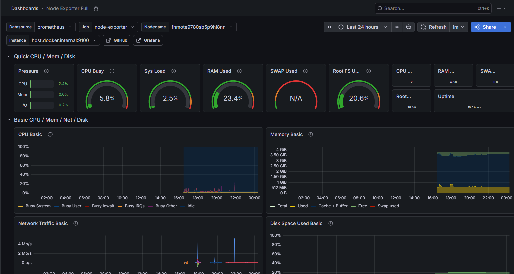

## 📊 Обсерваемость и Мониторинг (Observability)

В проекте развернут полноценный стек мониторинга и логирования, интегрированный в общую инфраструктуру и работающий через единый обратный прокси Nginx.

### Доступ к интерфейсам:
* **Grafana (Метрики и логи):** `http://130.193.37.59/grafana/`
  * *Данные для первого входа:* `admin` / `admin` (система потребует сменить пароль при входе).
* **Prometheus (Сбор метрик):** `http://130.193.37.59/prometheus/`
* **Loki (Сборщик логов):** Работает как внутренний сервис на порту `3100`, принимает логи из контейнеров через агент Promtail.

### Как смотреть логи приложения в Grafana:
1. Расскройте **Drilldown** (иконка дрели в левом меню).
2. Перейдите на страницу Logs.

### Проверка конфига `prometheus.yml` через Docker

Чтобы проверить твой файл на наличие синтаксических ошибок (например, если где-то сбились отступы в YAML), выполни эту команду на своем компьютере в терминале, **находясь в корневой папке проекта** (там, где лежит сам файл `prometheus.yml`):

```bash
docker run --rm -v $(pwd)/prometheus.yml:/etc/prometheus/prometheus.yml prom/prometheus:latest promtool check config /etc/prometheus/prometheus.yml

Скриншот Grafana
 - 